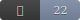

# nothing 

> "This is a perfectly empty project.
It has no bugs to fix, no maintenance to perform, and no expiration to fear.
To star it is to acknowledge the value of the void."

> unlicensed [WTFPL](http://www.wtfpl.net/)
